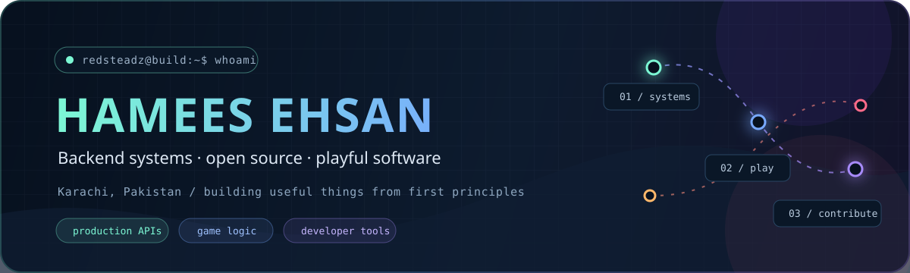

  

  
  

  <strong>Backend & systems engineer from Karachi, Pakistan.</strong> 
  Production APIs, asynchronous workflows, data-heavy applications, game logic, and the occasional strange experiment.

 

## `hello, world`

I am a final-year Computer Science student at **FAST-NUCES** and a software engineer who likes understanding systems beyond the happy path: how data moves, what fails under load, where abstractions leak, and how the experience can still feel simple to the person using it.

| `systems/` | `playground/` | `open-source/` |
|:---|:---|:---|
| Backend architecture, distributed workflows, databases, automation, and infrastructure | Game AI, simulations, procedural generation, and developer tools | Contributing to software I use and learning through maintainer feedback |

 

## `selected_work/`

| Project | What made it interesting |
| :--- | :--- |
| **[RedsRedis](https://github.com/redsteadz/RedsRedis)** | A multithreaded Redis-like server in C++ exploring sockets, custom data structures, sorted sets, packet handling, and offset-based retrieval. |
| **[ChaosCraze](https://github.com/redsteadz/ChaosCraze)** | An emergent NPC simulation where sentiment, age, occupation, and proximity influence interactions inside a reactive world. |
| **[PACMAN](https://github.com/redsteadz/PACMAN)** | A from-scratch recreation with distinct ghost targeting strategies, chase and scatter states, effects, and an in-game map editor. |
| **[PuzzledChess](https://github.com/redsteadz/PuzzledChess)** | A Lichess-powered chess puzzle game with animated moves, custom interface components, and multiple challenge modes. |

 

## `open-source/`

I contribute to **Nextcloud and its wider app ecosystem**, working across the server, Passwords, and Budget projects. What I value most is the process: understand a real problem, navigate an established codebase, learn from maintainer feedback, and leave the product a little better than I found it.

Open source is personal beyond contributions. My self-hosted Nextcloud setup grew from a tiny Android TV box into a home server for storage, automation, private services, and experiments — a constant reminder of how far accessible software can take an idea.

 

## `toolbox/`

`Python` · `Django` · `FastAPI` · `Go` · `C++` · `TypeScript` · `React` · `PostgreSQL` · `Redis` · `Celery` · `Kafka` · `Docker` · `Linux` · `Cloudflare`

 

## `beyond_code/`

Competitive programmer and ICPC World Finalist from Pakistan. Linux enthusiast. Interested in privacy-respecting infrastructure, self-hosting, AI systems, and creative programming. Always happy to talk about a difficult system, a strange bug, or a project that was simply fun to build.

 

<strong>Build it. Break it. Understand it. Leave it better.</strong>

